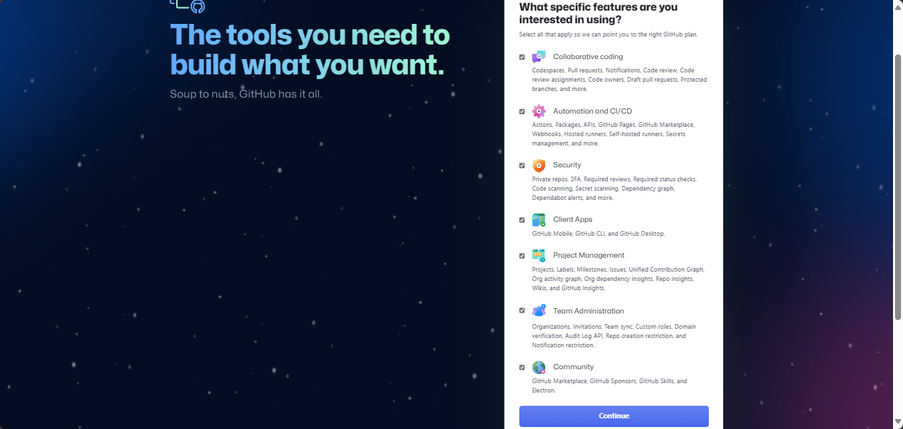
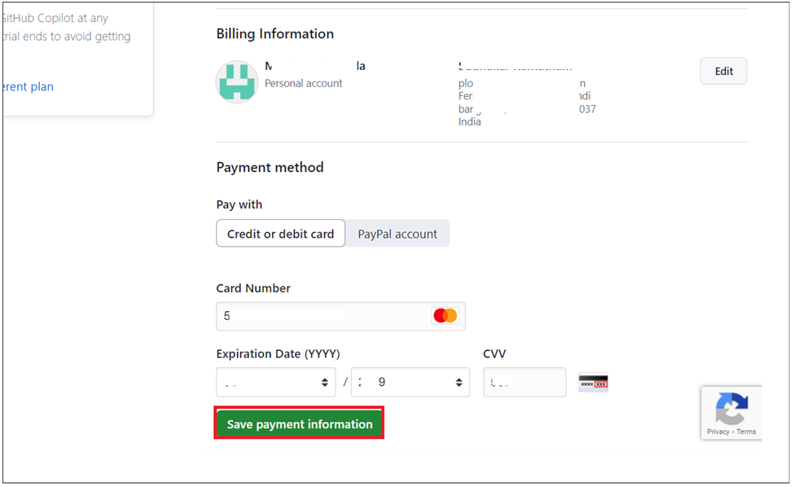

Lab 0: Preparing for the lab execution

Task 1: Signup for a GitHub account

Note: You can skip Task 1 and start with task 2 if you already created a
GitHub account.

1.  Open a new browser tab and navigate to +++<https://github.com/>+++

2.  Click on sign up on the GitHub homepage.

>  alt="A screenshot of a computer Description automatically generated" />

3.  Enter your email, password and a unique username and click on
    continue.

>  alt="A screenshot of a computer Description automatically generated" />

4.  On the next screen verify your account (solve the puzzle) and click
    Submit.

>  alt="A screenshot of a computer Description automatically generated" />
>
>  alt="A screenshot of a computer Description automatically generated" />
>
>  alt="A screenshot of a computer Description automatically generated" />

5.  Once the puzzle is verified then, you will be taken to a email
    verification page.

6.  Copy the code received in your mail box and paste it in the
    verification page.

>  alt="A screenshot of a computer Description automatically generated" />

7.  Select the required details like age, student and click on
    **Continue**

>  alt="A screenshot of a computer Description automatically generated" />
>
>  alt="A screenshot of a computer Description automatically generated" />
>
>  alt="A screenshot of a computer Description automatically generated" />

8.  You have successfully signed for a GitHub account.

Task 2: Signup for GitHub Copilot (trial) license

**If you still do not have an active Copilot license, a 30 day trial can
be requested with below steps . Make sure to cancel your license before
the trial ends to avoid getting billed**

1.  Open a new tab in your browser and go to Signup to GitHub Copilot -
    [**https://github.com/github-copilot/signup**](urn:gd:lg:a:send-vm-keys)

2.  Click on **Get access to GitHub Copilot** button.

3.  Enter billing information with your personal credit card and then
    click on **Save**.

4.  Enter your billing information and then click on **Save payment
    information** button.

IMPORTANT: Make sure to deactivate the account after you complete the
labs to avoid billing for usage.

Task 3: Install required extensions in Visual Studio code

1.  Open Visual Studio Code from the Windows Start menu .Click on
    **Accounts -\> Backup and Sync Settings** and select **Sign in.**

2.  Select **Sign in with Github** option

3.  Sect the Browser and Sign in with your Copilot enabled Github
    account.

4.  Authenticate and verify with the code to complete Twofactor
    authentication.

5.  Click on Visual Studio Code.

6.  Click on Extension from left navigation menu, search for [**Github
    Copilot**](urn:gd:lg:a:send-vm-keys), select it and click on
    **Install**.

7.  Search for [**Docker**](urn:gd:lg:a:send-vm-keys) and install it
    from Microsoft.

8.  Search for [**Extension Pack for JAVA**](urn:gd:lg:a:send-vm-keys)
    ,select it and **install** it.

9.  Search for [**Jupyter**](urn:gd:lg:a:send-vm-keys),seelct it and
    **install** it.

10. Search Python, select the one from Microsoft and **install** it.

