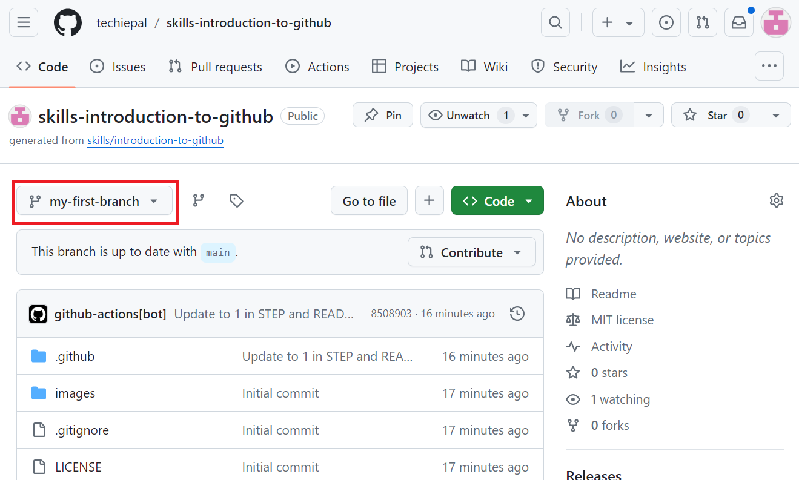

Lab 01: Create a GitHub repository and a branch

Objective:

Imagine you're new to software development and have joined a team that
uses GitHub for version control and collaboration. To effectively
contribute to your projects and engage with the open-source community,
you need a solid understanding of GitHub’s core concepts and
functionalities.

In this lab, you will:

- Create a repository from a template

- Create a Branch: Practice creating a new branch in a repository to
  explore parallel development and how branches facilitate independent
  work.

### Exercise \#1: Create a repository from a template and a branch within the repository

1.  Sign in to your GitHub account.

2.  Browse to the following link:
    <https://github.com/skills/introduction-to-github>

> In this lab you will create the repository using a public template
> “**skills-introduction-to-github**”.
>
>  style="width:5.50816in;height:3.19625in" />

3.  Select **Create a new repository** under **Use this template** menu.

>  alt="A screenshot of a computer Description automatically generated" />

4.  Enter the following details and select **Create Repository**.

- Repository name: **skills-introduction-to-github**

- Repository type: **Public**

>  style="width:4.17589in;height:4.18542in" />

5.  Navigate to the **Code** tab in the header menu of your repository.

> 

6.  Click on the main branch drop-down.

7.  In the **Find a branch** field, enter the name **my-first-branch**
    and select “Create branch

> **my-first-branch** from main”
>
>  alt="create-branch-button" />

8.  The branch will automatically switch to the one you have just
    created. The main branch drop-down bar will reflect your new branch
    and display the new branch name.

>  style="width:6.26736in;height:3.76458in" />

Summary:

In this lab, you have

- Initialized a new Git repository to start tracking your projects.

- Understood the process of creating branches to manage different
  features or versions of your code.
