# Lab 02: Secure your repository's supply chain

### Objectives:

Imagine you are responsible for maintaining the security of a software
project that relies on various third-party dependencies. To ensure the
integrity and safety of your project's supply chain, it's crucial to
understand and manage these dependencies effectively. This involves
identifying potential vulnerabilities within your dependencies and
applying necessary patches to secure your project. In this lab, you will
learn how to use GitHub's dependency graph feature to monitor and review
your dependencies, making sure your project remains secure and
up-to-date.

In this hands-on lab, you will:

- Enable Dependency Graph: Enable and verify the dependency graph
  feature in your repository settings to visualize your project's
  dependencies.

- Add a New Dependency: Add a new dependency to your project and ensure
  it is integrated properly.

- Review Dependency Graph: Use the dependency graph to review and
  confirm that the new dependency is correctly reflected and monitored.

### Exercise 01: Create a new repository

1.  Browse to the following link:
    <https://github.com/skills/secure-repository-supply-chain>

> In this lab you will create the repository using a public template
> **skills-secure-repository-supply-chain**
>
> 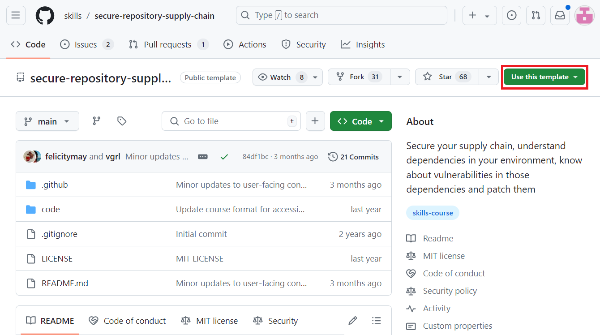

2.  Select **Create a new repository** under **Use this template** menu.

>  alt="A screenshot of a computer Description automatically generated" />

3.  Enter the following details and select **Create Repository**.

- Repository name: **skills-secure-repository-supply-chain**

- Repository type: **Public**

> 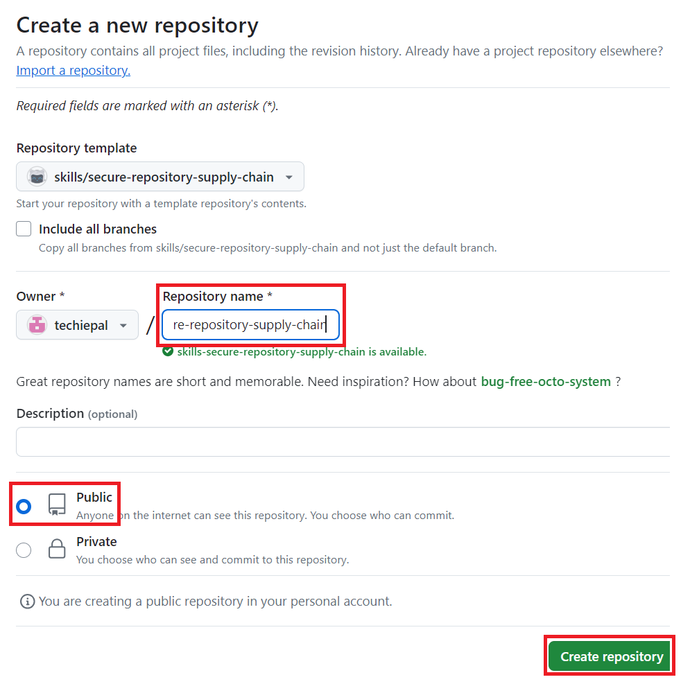 style="width:3.82548in;height:3.79473in" />

# Exercise 02: Verify that dependency graph is enabled

1.  On the landing page of the newly created repository navigate to the
    **Settings** tab.

> 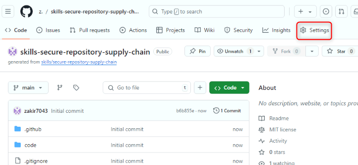 alt="A screenshot of a computer Description automatically generated" />

2.  On the **Settings** page, select **Code security and analysis**
    available under **Security.**

> 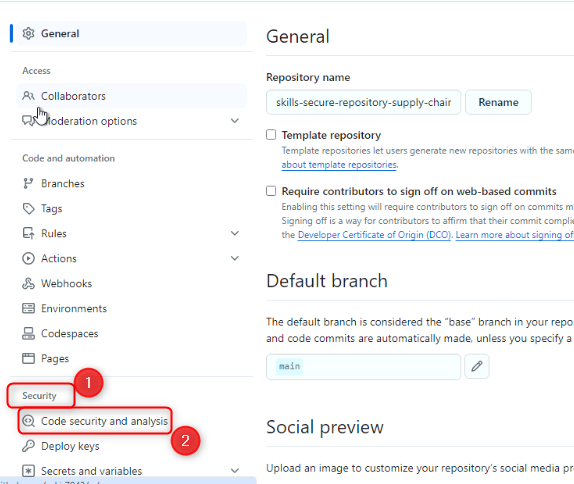 style="width:5.18137in;height:4.36896in" />

3.  Verify/enable Dependency graph. (If the repo is private, you will
    enable it here. If the repo is public, it will be enabled by
    default)

> 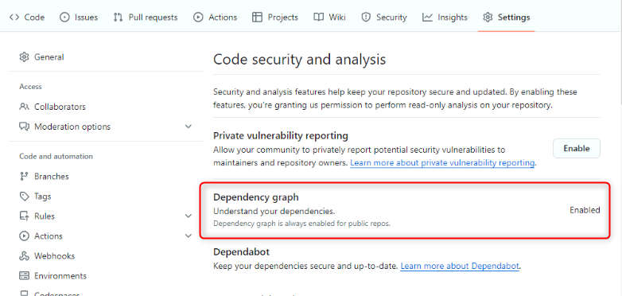 alt="A screenshot of a computer Description automatically generated" />

# Exercise 03: Add a new dependency and view your dependency graph

1.  Navigate to the **Code** tab and locate the
    **code/src/AttendeeSite** folder.

> Note: You can either browse to the folder or use the **Go to file**
> search **code/src/AttendeeSite**
>
> 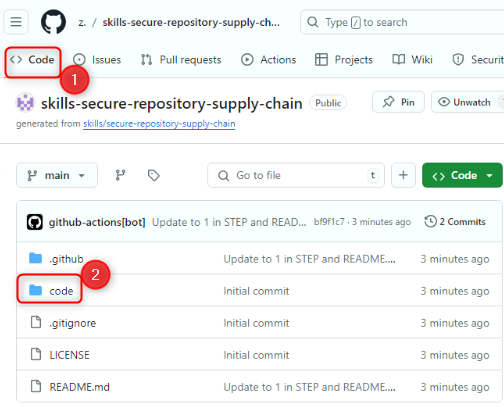 alt="A screenshot of a web page Description automatically generated" />
>
> 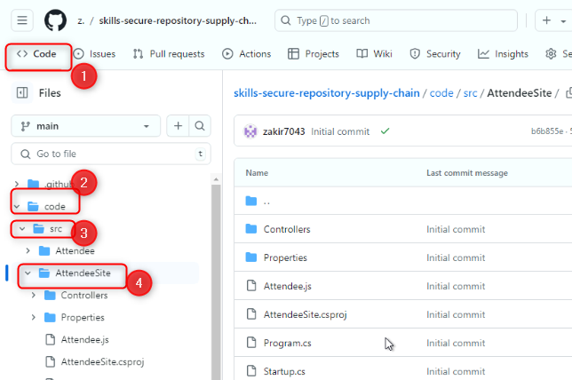

2.  Open the **package-lock.json** file

> 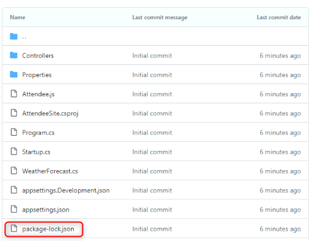
>
> 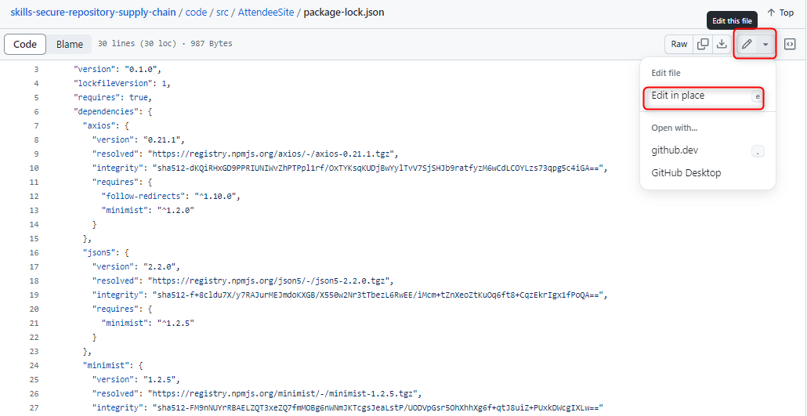

3.  Insert the following code snippet between line \# 14 and line \#15

},

"follow-redirects": {

"version": "1.14.1",

"resolved":
"https://registry.npmjs.org/follow-redirects/-/follow-redirects-1.14.1.tgz",

"integrity":
"sha512-HWqDgT7ZEkqRzBvc2s64vSZ/hfOceEol3ac/7tKwzuvEyWx3/4UegXh5oBOIotkGsObyk3xznnSRVADBgWSQVg=="

}

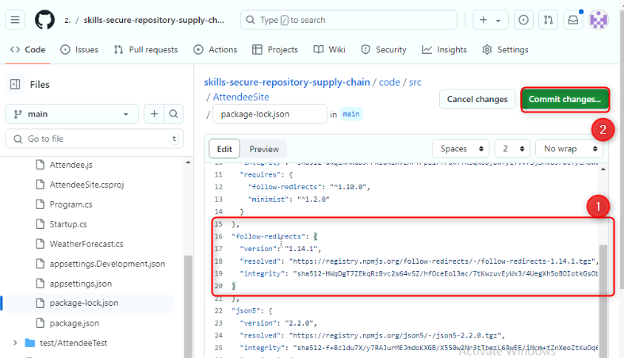

4.  Click **Commit changes** on the top right.

> 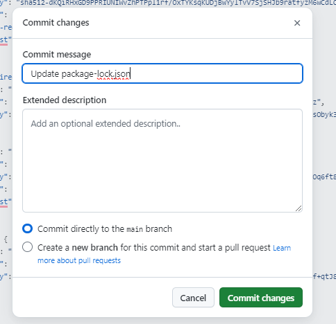 style="width:4.49065in;height:4.66971in" />

5.  On the main navigation bar click on the **Insights tab**.

> 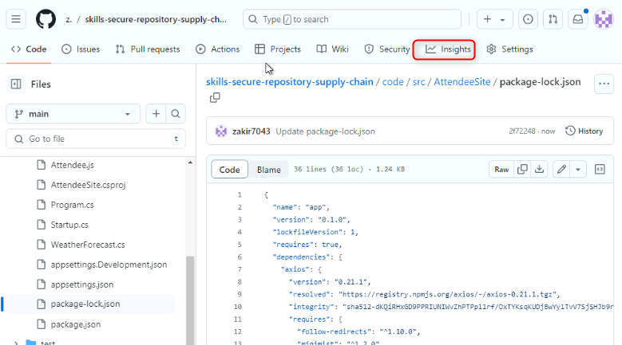 alt="A screenshot of a computer Description automatically generated" />

6.  On the left side navigation pane click on the **Dependency graph**.

> 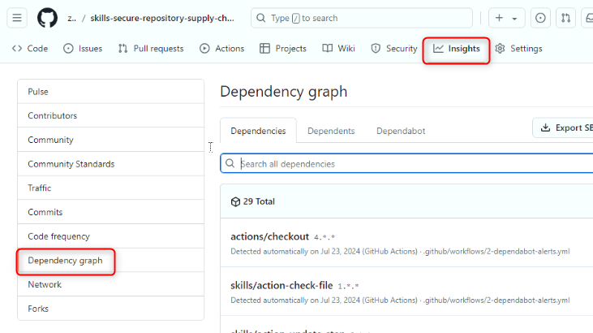 alt="A screenshot of a computer Description automatically generated" />

7.  Review all new dependencies on the Dependencies hub.

> 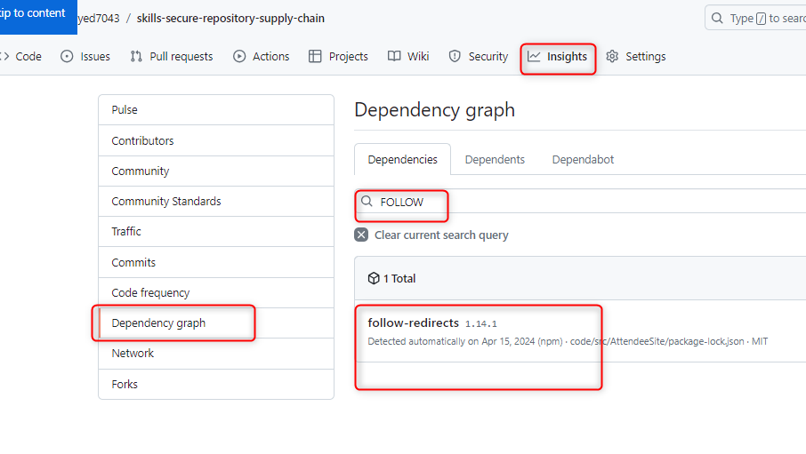 style="width:5.72658in;height:2.96363in" />

8.  Search for follow-redirects and review the new dependency you just
    added.

> 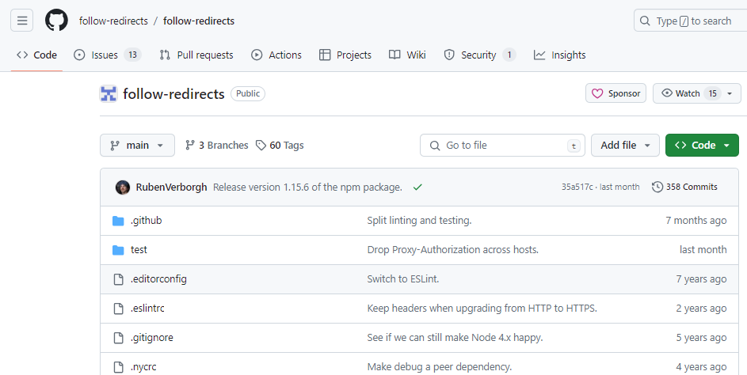 style="width:5.46094in;height:2.74447in" />

### Summary:

> You have now gained valuable insights into managing your project's
> dependencies and securing your repository's supply chain, allowing you
> to proactively address and mitigate security risks.
