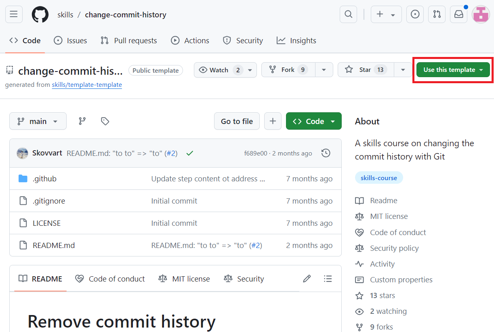
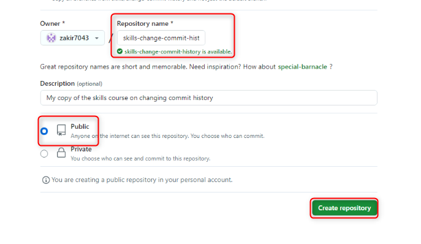
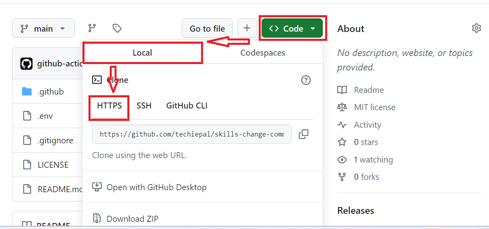
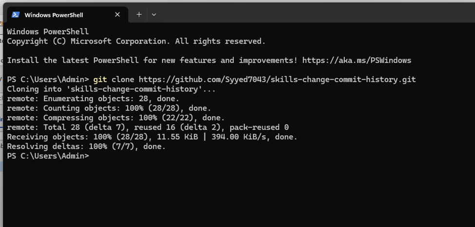
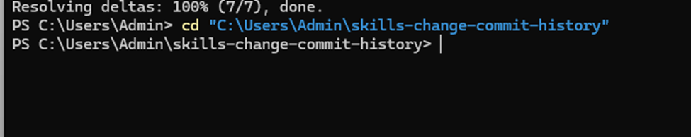
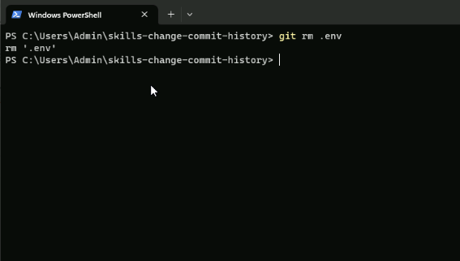
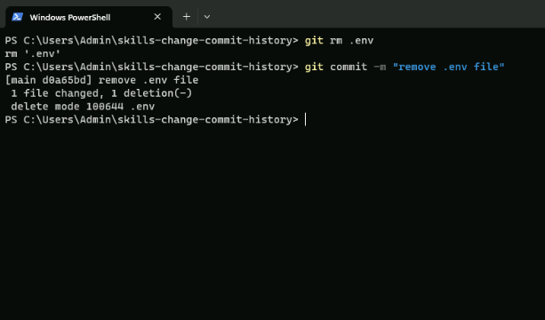
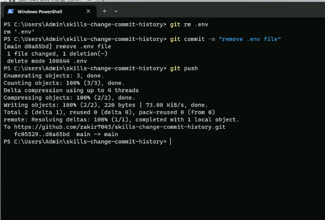

Lab 04: Remove Commit History from a Git Repository

Objective:

Imagine you are part of a development team working on a project where
sensitive information, such as API keys or database credentials, was
accidentally committed to your Git repository. Accidental commits can be
tricky to remove with Git.

In this lab, you will:

- Clone the repository with accidentally committed sensitive data.

- Remove/delete the file containing sensitive data from the cloned
  repository and Commit the removal.

- Push Changes to GitHub: Upload the updated repository to GitHub to
  reflect the changes.

### Exercise \#1: Create the repository with the accidental commit history (sensitive data)

1.  Sign in to your GitHub account.

2.  Browse to the following link:
    <https://github.com/skills/change-commit-history>

> In this lab you will create the repository using a public template
> “**skills-change-commit-history**”.
>
> 

3.  Select **Create a new repository** under **Use this template** menu.

>  alt="A screenshot of a computer Description automatically generated" />

4.  Enter the following details and select **Create Repository**.

- Repository name: **skills-change-commit-history**

- Repository type: **Public**

### Exercise \# 2: Remove/delete the file (.env in the project root directory) containing sensitive data

1.  On the landing page of the cloned repository, navigate to
    **Code**\>**Local**\>**HTTPS** and copy the URL.

2.  Open windows Powershell and enter the following command.

**git clone \<your-repository-url\>**

**Note**: Replace with the URL you copied in step 1.

> 

3.  Switch to your repository directory, enter the following command.

**+++cd “C:\Users\Admin\skills-change-commit-history”+++**

**Note**: Replace with the repository name

>  style="width:4.82487in;height:0.96003in" />

4.  Execute the following command to delete .env from the root
    directory,

**+++git rm .env**+++

>  alt="A screenshot of a computer screen Description automatically generated" />

5.  Commit the removal of .env file

**+++git commit -m "remove .env file”+++**

>  alt="A screen shot of a computer Description automatically generated" />
>
> **Tip**: How to completely remove .env file from Git history and
> rewrite total history with new commit hashes?
>
> Use the following commands to:

- Completely remove .env file from Git history and rewrite total history

> **git filter-branch --force --index-filter 'git rm --cached
> --ignore-unmatch.env' --prune-empty --tag-name-filter cat -- --all**

- Push the removal to GitHub

> **git push origin --force –all**

6.  Push the removal to GitHub:

**git push**

>  alt="A screen shot of a computer program Description automatically generated" />

Summary:

Now you have completed cleaning up your Git repository, ensuring that
sensitive content is not exposed in the repository’s history.
