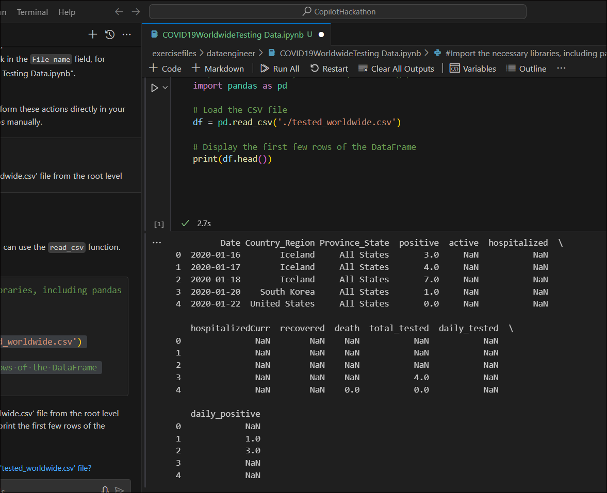
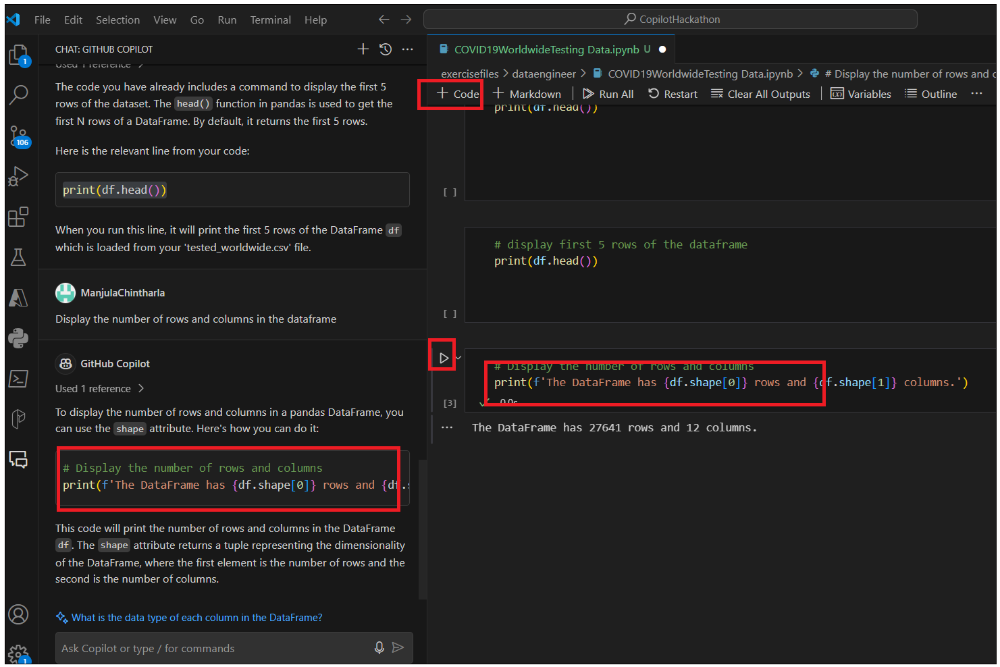
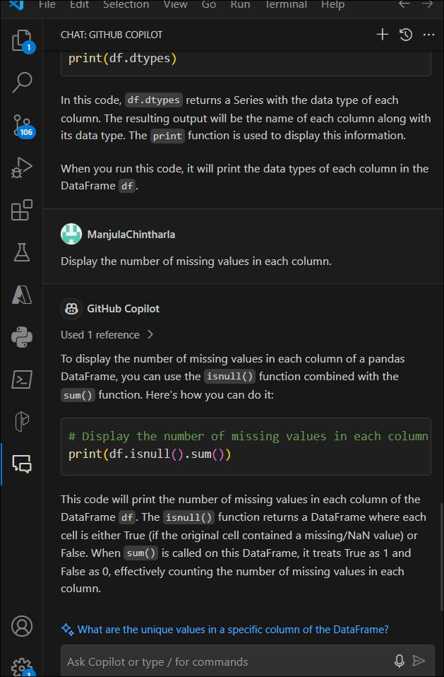
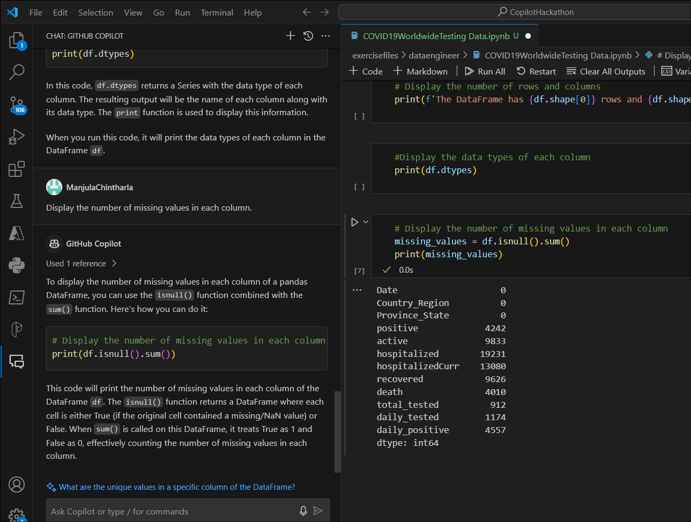
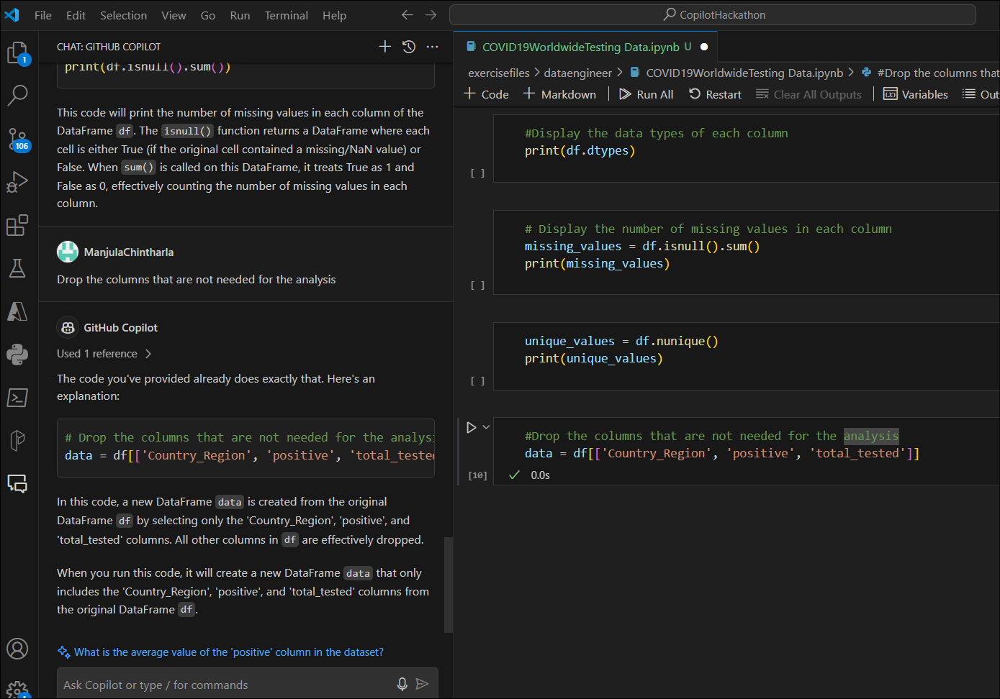
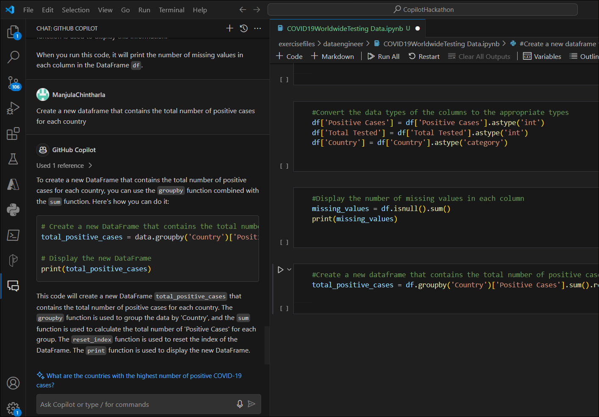
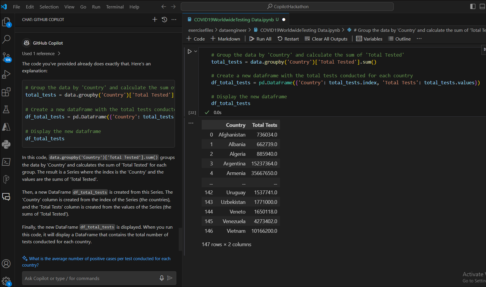

# Lab 07- Create a Notebook using Github Copilot chat and provide answers based on Test data

**INTRODUCTION**

This dataset tested_worldwide.csv is origin from Kaggle. This dataset,
which has the number of tests conducted over time, is important to help
make sense of daily reported cases and understand how COVID-19 is truly
spreading in each country.

**INSTRUCTIONS**

1.  Open Visual Studio Code from the Windows Start menu and open the
    folder navigating to C:\Labfiles\CopilotHackathon

>  alt="A screenshot of a computer Description automatically generated" />

2.  Click on **Yes,I Trust the Author** button.

3.  Click on **Copilot** icon on right side down corner and select
    **Github Copilot Chat.**

4.  Type your prompt create a new notebook in a project. Use command
    /newnotebook and name it as "COVID19 Worldwide Testing Data"

>  style="width:6.49167in;height:6.03333in" />

5.  You can see the Copilot instructions helping you with instructions.
    Follow the steps and create the notebook.

- Open the command palette by pressing **Ctrl+Shift+P.**

- Type Jupyter: Create New Blank Notebook and press Enter.

>  style="width:6.49167in;height:5.30833in" />

- A new notebook will be created. Save it with the name
  COVID19WorldwideTesting Data.ipynb.You can also ask Copilot how to
  save a new notebook.

> 

- Go to the destination folder – **excercisefiles-? dataengineer** enter
  the COVID19WorldwideTesting Data.ipynb and save the file.

> 

6.  You should see the file was created under **dataengineer** folder.

2\. Use Copilot and Copilot Chat to develop the exercise and support
your learning.

**EXERCISE**

Our analysis tries to provide an answer to this question: **Which
countries have reported the highest number of positive cases in relation
to the number of tests conducted?**

**Task 1: Import Required Libraries**

1.  Click on Notebook kernel and type \#*Import Required
    Libraries.Including Pandas and* press Enter

2.  Press tab. It will take you to the end of the line. Press Enter and
    again press Tab to add all libraries.

\# Import the necessary libraries, including pandas.

*\# Import Required Libraries*

*\# Here we are importing the necessary libraries for our task*

**import** pandas **as** pd *\# pandas is a software library written for
the Python programming language for data manipulation and analysis.*

# **Task 2 : Load the Dataset**

1.  Use pandas to load the 'tested_worldwide.csv' file from the root
    level.

2.  Ask Github Copilot to help you on how to load data. Enter Use pandas
    to load the 'tested_worldwide.csv' file from the root level

3.  Enter the below code in a Notebook and run it.It will ask you to
    select **Python Environment**. Select it.

7.  Select the recommended environment. script runs and provides the
    results.

### Task 3 : Understanding the Data

1.  Use the head() function to display the first 5 rows of the dataset

2.  Ask your Github Copilot to help you with the code to display first 5
    rows of the dataset. display first 5 rows of the dataset

>  style="width:6.49167in;height:7.01667in" />

3.  Click on **+ code** to open new kerner. Just enter \# display first
    5 rows of dataset. It will automatically predict your question. Just
    press tag and then press Enter.

>  alt="Screens screenshot of a computer screen Description automatically generated" />

8.  **Coiplot** predicts the command you are looking for, so press the
    tab to accept the code. You always have the option to edit/write
    your own code.

9.  Press the tab and accept the code. Run the kernel.

10. You should see the results.

11. 

9\. Ask your copilot to help with Display the number of rows and columns
in the dataframe. Click on +code .enter the code and then run the
kernel. You can also use below code

num_rows, num_cols **=** data**.**shape

print("Number of rows:", num_rows)

print("Number of columns:", num_cols)

10\. Ask your Copilot to help you with this**Display the data types of
each column** .You can also user data.dttypes

12. Ask your GitHub Copilot provide code for Display the number of
    missing values in each column.

13\. Add a new kernel and add the below code and run it. You can also
use the code suggested by Copilot and check

missing_values **=** df**.**isnull()**.**sum()

print(missing_values)

13. Run the below code in the new kernel to Display the number of unique
    values in each column. Check with your copilot about code and
    results.

unique_values **=** df**.**nunique()

print(unique_values)

**Task 4 : Data Cleaning**

1.  Run the below code to Drop the columns that are not needed for the
    analysis. Ask you copilot for the code and check the results.

> data **=** df\[\['Country_Region', 'positive', 'total_tested'\]\]

2.  Type \#Rename the columns to make them more readable In a new kernel
    and accept the code.

>  alt="A screenshot of a computer Description automatically generated" />

3.  You can use the below code and run it.

df**.**rename(columns**=**{'Country_Region': 'Country', 'positive':
'Positive Cases', 'total_tested': 'Total Tested'}, inplace**=True**)

4.  Ask your copilot to Drop the rows that have missing values And run
    the code in a new kernel or Type \#Drop the rows that have missing
    values In new kernel press enter. Press the tab and accept the code

5.  Add a new +Code kernel and type \#Convert the data types of the
    columns to the appropriate types , press **tag** to accept the code,
    again enter and press tab. Generate code for Positive cases, Total
    Tested and country, and then run it.

6.  Add a new +Code kernel and type \#Display the number of missing
    values in each column And press Enter. Press tab and accept the
    code. You can also ask in GitHub Copilot chat

>  alt="A screenshot of a computer program Description automatically generated" />
>
>  alt="A screenshot of a computer screen Description automatically generated" />

**Task 5 : Extracting the Top Ten Countries with Most Covid-19 Cases.**

1.  Ask your Copilot chat to help you with code Create a new dataframe
    that contains the total number of positive cases for each country Or
    open new code and type \#Create a new dataframe that contains the
    total number of positive cases for each country and press Etner.
    Press tab to accep the code.

2.  In a new code enter below prompts and enter after each prompt to
    accept the code and run it.

*\# Group the data by 'Country' and calculate the sum of 'Positive
Cases'*

total_positive_cases **=** data**.**groupby('Country')\['Positive
Cases'\]**.**sum()

*\# Create a new dataframe with the total positive cases for each
country*

df_total_positive_cases **=** pd**.**DataFrame({'Country':
total_positive_cases**.**index, 'Total Positive Cases':
total_positive_cases**.**values})

*\# Display the new dataframe*

df_total_positive_cases

3.  Ask Copilot to Sort the dataframe in descending order of the total
    number of positive cases Or type \# Sort the dataframe in descending
    order of the total number of positive cases In the new Code kernel
    press tag to accept the code and run it.

4.  Ask your Github Copilot chat to help you with Display the top ten
    countries with the most positive cases Or type \# Display the top
    ten countries with the most positive cases In new code kernel and
    runt it. Remember you just need to display.

**Task 6 : Identifying the Highest Positive Against Tested Cases**

1.  Ask your GitHub Copilot Chat to help you with thisCreate a new
    dataframe that contains the total number of tests conducted for each
    country or open new Code kernel and type \# Create a new dataframe
    that contains the total number of tests conducted for each country
    and press tab to accep the code. You can edit the code if required
    and run it.

*\# Group the data by 'Country' and calculate the sum of 'Total Tested'*

total_tests **=** data**.**groupby('Country')\['Total
Tested'\]**.**sum()

*\# Create a new dataframe with the total tests conducted for each
country*

df_total_tests **=** pd**.**DataFrame({'Country': total_tests**.**index,
'Total Tests': total_tests**.**values})

*\# Display the new dataframe*

df_total_tests

2.  Ask your Github Copilot Chat Sort the dataframe in descending order
    of the total number of tests conducted Or open a new code kernel
    ,type \# Sort the dataframe in descending order of the total number
    of tests conducted And press tab to caccep the code and run it.

>  alt="A screenshot of a computer program Description automatically generated" />

3.  Ask your Github Copilot Chat Display the top ten countries with the
    most tests conducted Or open a new code kernel ,type \# Display the
    top ten countries with the most tests conducted And press tab to
    caccep the code and run it.

>  alt="A screenshot of a computer program Description automatically generated" />

**Task 7 : Identifying top three countries that have had the highest
number of positive cases against the number of tests carried out**

1.  Ask your Github Copilot Chat Merge the two dataframes created in the
    previous steps Or open a new code kernel and type \# Display the top
    ten countries with the most tests conducted And press tab to caccep
    the code and run it.

2.  Ask your Github Copilot Chat Create a new column that contains the
    ratio of positive cases to the number of tests conducted Or open a
    new code kernel and type \# Create a new column that contains the
    ratio of positive cases to the number of tests conducted And press
    tab to accept the code and run it.

>  alt="A screenshot of a computer Description automatically generated" />

3.  Ask your Github Copilot Chat Sort the dataframe in descending order
    of the ratio of positive cases to the number of tests conducted Or
    open a new code kernel and type \# Sort the dataframe in descending
    order of the ratio of positive cases to the number of tests
    conducted And press the tab to accept the code and run it.

4.  Ask your Github Copilot Chat Display the top three countries with
    the highest ratio of positive cases to the number of tests conducted
    Or open a new code kernel and type \#Display the top three countries
    with the highest ratio of positive cases to the number of tests
    conducted And press the tab to accept the code and run it

> \#Display the top three countries with the highest ratio of positive
> cases to the number of tests conducted
>
> top_countries = merged_df.nlargest(3, 'Positive Test Rate')
>
> top_countries\[\['Country', 'Positive Test Rate'\]\]

**Task 8 : Displaying the Results**

1.  Ask your Github Copilot Chat to Display the results a chart that
    shows the top three countries with the highest ratio of positive
    cases to the number Or open a new code kernel and type \# Display
    the results a chart that shows the top three countries with the
    highest ratio of positive cases to the number And press the tab to
    accept the code and run it

\#Display the results a chart that shows the top three countries with
the highest ratio of positive cases to the number

import matplotlib.pyplot as plt

top_countries.plot(x='Country', y='Positive Test Rate', kind='bar')

2.  Ask your Github Copilot Chat to Display the results in a chart that
    shows the top ten countries with the most positive cases Or open a
    new code kernel and type \# Display the results in a chart that
    shows the top ten countries with the most positive cases And press
    the tab to accept the code and run it

\#Display the results in a chart that shows the top ten countries with
the most positive cases

import matplotlib.pyplot as plt

df_total_positive_cases.head(10).plot(x='Country', y='Total Positive
Cases', kind='bar')

plt.xlabel('Country')

plt.ylabel('Total Positive Cases')

plt.title('Top Ten Countries with the Most Positive Cases')

plt.show()

3\. Ask your Github Copilot Chat to Display the results in a chart that
shows the top ten countries with the most tests conducted Or open a new
code kernel and type \# Display the results in a chart that shows the
top ten countries with the most tests conducted And press the tab to
accept the code and run it

**Task 9: Conclusion**

1.  What are your conclusions?

2.  What are the limitations of this analysis?

3.  What are the next steps you would take to improve this analysis?
